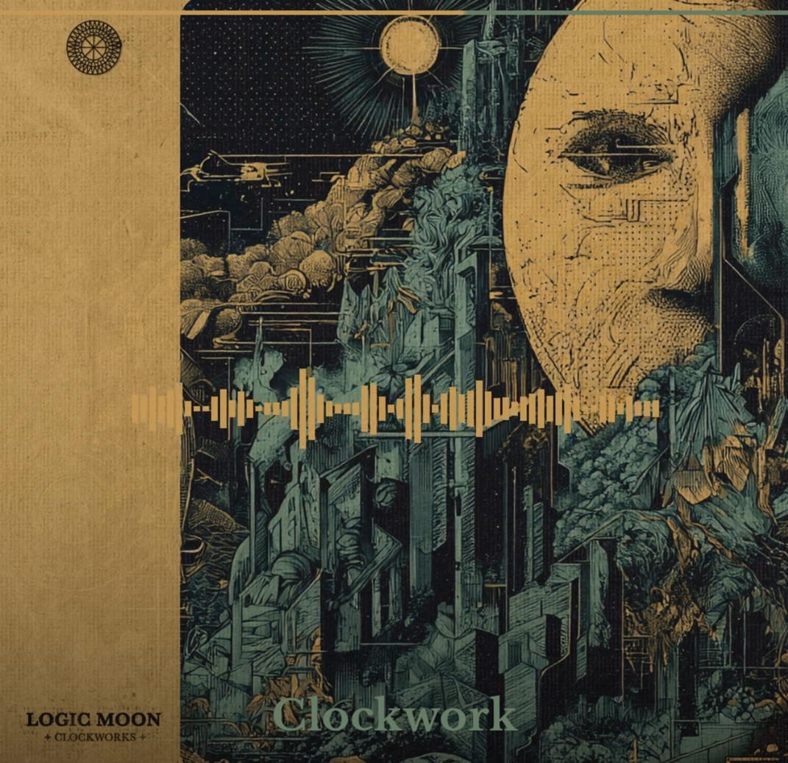

# instagram-tile-generator

Generate Instagram-ready MP4 tiles from audio tracks and cover art. Each tile combines a full-bleed cover image, an animated waveform, and a text overlay (headline, track title, optional copy). Output is exported as MP4 (feed or Reels format) or as static PNGs for carousel posts.



## Features

- Animated waveform derived from the audio signal
- Full-bleed cover image with smooth dark gradient overlay
- Dominant color extracted from the cover — used for waveform and headline accent
- Three output formats: square feed (1:1), Reels/Stories (9:16), carousel (static PNGs)
- Clip taken from the center of the track by default
- Per-track or global start offset, specified as a timecode (`1:23`) or seconds (`83`)
- Audio fade-in and fade-out
- Optional audio progress bar
- Custom font support via CLI or `config.json`
- `--force` to overwrite existing exports, skip-by-default otherwise
- Config file auto-generation via `--init`
- Falls back to filename-based metadata if no `config.json` is present

## Requirements

Python 3.10+ and [ffmpeg](https://ffmpeg.org/) installed on your system.

```bash
python -m venv venv
source venv/bin/activate
pip install -r requirements.txt
```

## Data layout

```
data/
└── my-release/
    ├── cover.png               # shared cover image (fallback for all tracks)
    ├── track-01.wav
    ├── track-02.wav
    └── config.json             # optional — see below
export/
└── my-release/
    ├── square/
    │   ├── track_01.mp4
    │   └── track_02.mp4
    ├── reel/
    │   └── track_01.mp4
    └── carousel/
        ├── 01_track_01.png
        └── 02_track_02.png
```

Multiple audio formats are supported as long as ffmpeg can decode them (`.wav`, `.mp3`, `.flac`, `.aiff`, etc.). Only `.wav` files are discovered automatically when no `config.json` is present.

## Quickstart

```bash
# 1. Generate a config.json skeleton, then edit it
python generate.py data/my-release --init --duration 30

# 2. Check the output visually before a full render
python generate.py data/my-release --preview

# 3. Render square feed tiles (1080×1080), 30s clips
python generate.py data/my-release --duration 30

# Re-render with changes, overwriting existing files
python generate.py data/my-release --duration 30 --force

# Reels/Stories format (1080×1920)
python generate.py data/my-release --duration 30 --format reel

# Carousel (static PNGs, one per track)
python generate.py data/my-release --format carousel

# With progress bar and a fixed accent color
python generate.py data/my-release --duration 30 --progress-bar --accent-color "#e8a020"

# Custom font
python generate.py data/my-release --duration 30 --font fonts/MyFont.ttf
```

## CLI reference

```
python generate.py <data_dir> [options]
```

| Argument | Description |
|---|---|
| `data_dir` | Path to the release folder, e.g. `data/my-release` |
| `--init` | Scan `data_dir` and write a `config.json` skeleton, then exit |
| `--duration SECS` | Clip length in seconds. Overrides `config.json`. |
| `--start TIME` | Clip start time as `M:SS` or seconds, e.g. `1:23` or `83`. Overrides `config.json` per-track values. Default: center of track. |
| `--format FORMAT` | `square` (1080×1080, default), `reel` (1080×1920), `carousel` (static PNGs), `all` (every format) |
| `--preview` | Render a static PNG preview per track instead of encoding MP4 |
| `--force` | Overwrite existing output files (default: skip if file exists) |
| `--progress-bar` | Show a playback progress bar (default position: top) |
| `--progress-bar-position` | `top` (default) or `bottom` |
| `--accent-color COLOR` | Accent color as `#rrggbb` or `r,g,b`. Overrides config and auto-extraction. |
| `--font-color COLOR` | Text color for title and copy as `#rrggbb` or `r,g,b`. Default: white. |
| `--overlay-color COLOR` | Gradient overlay color as `#rrggbb` or `r,g,b`. Default: `#000000`. |
| `--overlay-opacity N` | Gradient overlay strength `0.0`–`1.0`. Default: `0.7`. |
| `--font NAME_OR_PATH` | Font name (e.g. `"Inter"`) or path to a `.ttf`/`.otf` file. Overrides `config.json` and system font. |

### Without a config.json

If no `config.json` is present, the script auto-discovers all `.wav` files in the folder and uses `cover.png` as the cover image for every track. Track titles are parsed from filenames (`Artist - Title_02.wav` → `Title`). This is useful for a quick test render before investing time in a config.

### `--init` details

`--init` scans `data_dir` for `.wav` files and writes a fully pre-filled `config.json`. All fields are included with sensible defaults, ready to edit:
- `start` is pre-calculated as the center of each track based on `--duration`
- `accent_color` is auto-detected from the cover image and written as an editable hex value
- All per-track overrides (`font`, `font_color`, `overlay_color`, `overlay_opacity`, `accent_color`) are included as `null`, ready to uncomment
- A `$schema` reference to `config.schema.json` is added for IDE autocompletion

## config.json

```json
{
  "$schema":               "../../config.schema.json",
  "ep_title":              "My Release",
  "clip_duration":         30,
  "accent_color":          "#e8a020",
  "font_color":            null,
  "font":                  null,
  "format":                "square",
  "overlay_color":         "#000000",
  "overlay_opacity":       0.7,
  "progress_bar":          true,
  "progress_bar_position": "top",
  "tracks": [
    {
      "audio":           "track-01.wav",
      "image":           "cover.png",
      "headline":        "OUT NOW",
      "title":           "Track Title",
      "copy":            "Optional copy text shown below the title",
      "start":           "1:23",
      "accent_color":    null,
      "font_color":      null,
      "font":            null,
      "overlay_color":   null,
      "overlay_opacity": null
    }
  ]
}
```

`accent_color` accepts a hex string (`"#e8a020"`) or an RGB array (`[232, 160, 32]`). When `null`, the dominant color is extracted automatically from the cover image.

**Priority order** (highest wins): CLI flag → per-track config → EP-level config → auto-extracted dominant color.

**EP-level fields**

| Field | Default | Description |
|---|---|---|
| `ep_title` | folder name | Used as the export subfolder name |
| `clip_duration` | full track | Default clip length in seconds |
| `accent_color` | `null` | Accent color for waveform and headline. Hex or RGB array. |
| `font_color` | `null` | Text color for title and copy. Hex or RGB array. Default: white. |
| `font` | `null` | Font name (e.g. `"Inter"`) or path to a `.ttf`/`.otf` file |
| `format` | `"square"` | Default output format: `"square"`, `"reel"`, `"carousel"`, or `"all"` |
| `overlay_color` | `"#000000"` | Gradient overlay color. Hex or RGB array. |
| `overlay_opacity` | `0.7` | Gradient overlay strength `0.0`–`1.0`. |
| `progress_bar` | `true` | Show playback progress bar on all tiles |
| `progress_bar_position` | `"top"` | Position of the progress bar: `"top"` or `"bottom"` |
| `progress_bar_color` | `null` | Color of the progress bar background track. Hex or RGB array. Default: white. |
| `typewriter_headline` | `false` | Animate headline with a typewriter effect |
| `typewriter_copy` | `false` | Animate copy text with a typewriter effect (starts after headline) |

**Per-track fields**

| Field | Required | Description |
|---|---|---|
| `audio` | yes | Filename relative to the release folder |
| `image` | no | Cover image filename. Falls back to `cover.png` |
| `headline` | no | Small uppercase label above the title |
| `title` | no | Track title. Parsed from filename if omitted |
| `copy` | no | Small text line below the title |
| `start` | no | Clip start as `M:SS` or seconds. Default: center of track |
| `overlay_color` | no | Override EP-level overlay color for this track only |
| `overlay_opacity` | no | Override EP-level overlay opacity for this track only |
| `accent_color` | no | Override EP-level accent color for this track only |
| `font_color` | no | Override EP-level font color for this track only |
| `font` | no | Override EP-level font (name or path) for this track only |
| `progress_bar_color` | no | Override EP-level progress bar background color for this track only |
| `typewriter_headline` | no | Override EP-level typewriter setting for the headline |
| `typewriter_copy` | no | Override EP-level typewriter setting for the copy text |

## Output

Rendered files are written to `./export/<release-name>/<format>/`.

| Format | Path | Resolution |
|---|---|---|
| `square` | `export/<release>/square/track.mp4` | 1080×1080 |
| `reel` | `export/<release>/reel/track.mp4` | 1080×1920 |
| `carousel` | `export/<release>/carousel/01_track.png` | 1080×1080 |
| `--preview` | `export/<release>/<format>/track_preview.png` | format-dependent |

The 1080×1080 canvas uses 160 px of horizontal padding, keeping all content within the safe zone that remains visible when Instagram crops to 4:5.

## JSON Schema

`config.schema.json` at the project root describes every field in `config.json`. Editors that support JSON Schema (VS Code, JetBrains, etc.) will show autocompletion and inline documentation when the `$schema` key is present — which `--init` adds automatically.
